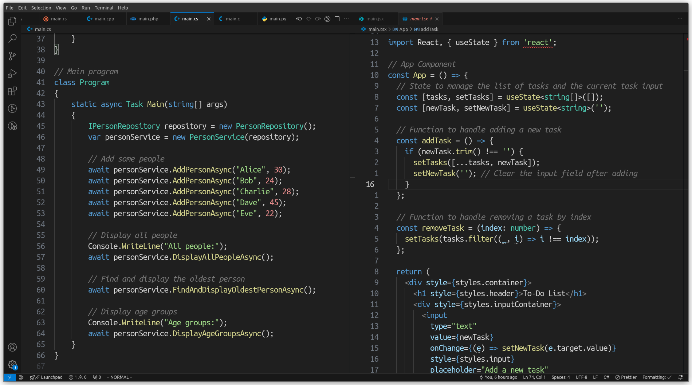

	<h1 align="center">Dark Modern But Better</h1>
	<h3 align="center">
		Its mostly same theme as one shipped with vscode with minor changes:
	</h3>
	<ul>
		<li>Got rid of that ugly ass string color, now its nice green</li>
		<li>Since strings are green, numbers has been changed to pinkish-red</li>
		<li>Every purple keyword is now good old blue</li>
		<li>Changed color of variables to plain white, cuz there is too much color already</li>
		<li>Comments are grey as they should be from beginning</li>
		<li>Made functions yellow a little bit more vibrant</li>
		<li>JSON keys are plain white (although im not sure if i like this one)</li>
		<li>additionally with semantic highlighting, parameters are light blue</li>
	</ul>
	<h3 align="center">
		Feel free to create issues or pr's on <a src="https://github.com/sKsieciunio/dark-modern-but-better">github</a> repo
	</h3>

	

